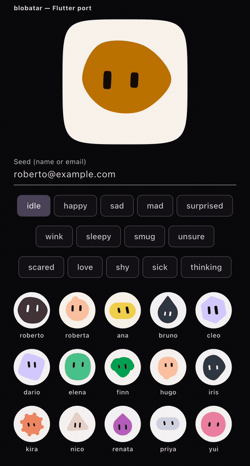

# blobatar (Flutter)

A native Flutter port of **[blobatar](https://github.com/Alain00/blobatar)**:
deterministic, generative blob avatars — the same `name` always renders the
same blobatar. Painted straight onto a `CustomPainter` with `dart:ui.Path`,
with no SVG anywhere in the pipeline.

This is not a wrapper, and not `flutter_svg` around the original package. It
is a full Dart reimplementation of the algorithm (hash, geometry, colour) and
of the pose and animation system, MIT-licensed like the original.

This is a community port: it is not maintained by
[Alain00](https://github.com/Alain00), blobatar's original author.

<p align="center">
  
</p>

One seed, fourteen expressions, recorded from `example/` on an iOS simulator.
The grid underneath is fifteen other seeds, chosen so that all ten silhouettes
are on screen at once.

## Verified parity

The central claim — the same `name` renders the same blobatar here as in the
JavaScript version — **is checked against the original, not against itself**.
`tool/extract_upstream_vectors.ts` runs the JavaScript blobatar and writes
`test/fixtures/upstream_gen2.json`; `test/parity_test.dart` compares every
number with exact equality and no tolerances.

Recording this port's own output would make the promise check itself, so the
fixture is only ever generated by running upstream.

The corpus is 349 seeds with **at least 25 per silhouette** — the band table
is weighted, so `triangle` and `sun` would barely appear in a uniform sample —
and covers precomposed and decomposed Latin, non-BMP emoji, and untrimmed
mixed case. Plus all 14 expression poses.

Current status: **714 parity assertions green against upstream 2.4.0** (gen2,
ten silhouettes).

To regenerate:

```bash
git clone --depth 1 https://github.com/Alain00/blobatar /tmp/blobatar
bun tool/extract_upstream_vectors.ts /tmp/blobatar > test/fixtures/upstream_gen2.json
```

A diff in that fixture means either upstream moved to a new generation or this
port drifted. Neither is fixed by regenerating without reading the diff first.

## What is a faithful port, and what is adapted

**Exact, bit for bit** (with the two caveats below):

- `hash.dart` — the 32-bit murmur3-style hash, with a float-safe `Math.imul`
  polyfill (which matters for Flutter Web and Wasm).
- `shape.dart` — superellipses, the organic Catmull-Rom spline, and the
  polygon, box and taper primitives, all building `Path` objects directly.
- `color.dart` — the full OKLCh pipeline: gamut mapping, WCAG contrast, the
  tone ramp and the expression tints.
- `layout.dart` + `shapes.dart` — the gen2 composer: the band table, the ten
  silhouettes (`round`, `organic`, `boxy`, `capsule`, `nub`, `cloud`,
  `droplet`, `hexagon`, `sun`, `triangle`) and the eye fit against each one's
  face region.

**Faithful in design, re-implemented in mechanism** — same values, same visual
intent, rebuilt on Flutter primitives because CSS custom properties and
keyframes have no direct equivalent:

- `pose.dart` — the 14 expressions (`happy`, `sad`, `mad`, `love`,
  `thinking`…) with their exact pose values and palette tints.
- `motion.dart` — breathing, bob, blink, gaze (`saccade`), the tremor, and
  `thinking`'s eye seesaw (900ms, `ease-in-out`), all with the same
  per-seed periods, durations and phases.
- `lib/blobatar_flutter.dart` — the morph between expressions (300ms
  entering, 400ms returning to idle, on the same
  `cubic-bezier(0.45,0.05,0.5,1)` curve).

**Deliberately simplified:** the eye "wrap" during a glance — a slight
foreshortening and rotation of a few hundredths of a degree, hand-tuned per
each of the six fixation directions — is not ported. The dominant translate is
there; that secondary polish pass is not. It is imperceptible outside a
frame-by-frame comparison.

### Caveat: Unicode normalization

The original calls JavaScript's `"…".normalize("NFC")`. Dart ships no Unicode
normalization, so this port carries a composition table for the common Latin
diacritics (á, é, ñ, ç, ü…) — enough for the names, emails and handles you
will actually see, but not full NFC (Vietnamese stacked diacritics, Hangul
jamo composition). If your app needs that, replace `_nfcLite` in `hash.dart`
with a call into a package like `unorm_dart`; nothing downstream changes,
since only that function's output matters.

### Caveat: `Math.hypot`

Upstream's eye fit runs through `Math.hypot`, which is **not bit-stable across
JavaScript engines**. V8 (Chrome, Edge, Node) evaluates it as
`max·√((a/max)²+(b/max)²)`; JavaScriptCore (Safari, Bun) uses a
correctly-rounded algorithm that disagrees by one unit in the last place on
roughly a third of inputs — verified over 300,000 pairs on both.

Upstream's **rendered output is unaffected**: it serializes SVG coordinates
through `Math.round(v * 100) / 100`, and that rounding absorbs the difference
on all 349 seeds measured. It survives only in the unrounded numbers upstream's
`layout()` export returns — and this port paints straight from those, with no
rounding step to hide behind, so it has to choose an engine.

It chooses V8, because that is what the large majority of blobatar's users
see, and the extractor normalizes the fixture to V8 rather than silently
recording whichever engine generated it. The gap reaches the 16th significant
digit, around 1e-13 of a pixel — invisible either way.

## Usage

```dart
import 'package:blobatar_flutter/blobatar_flutter.dart';

// Static, no animation.
Blobatar(name: 'roberto@example.com', size: 96)

// With a backdrop and soft corners.
Blobatar(
  name: 'roberto@example.com',
  size: 96,
  backdrop: BlobatarBackdrop.squircle,
)

// Animated: breathes, blinks and looks around while pointed at.
Blobatar(
  name: 'roberto@example.com',
  size: 160,
  animate: BlobatarAnimate.hover,
)

// Always animated — for one large avatar, not for a grid.
Blobatar(
  name: 'roberto@example.com',
  size: 220,
  animate: BlobatarAnimate.always,
  expression: happyExpression,
)

// `thinking` is the only expression that rocks the eyes, so it needs
// `animate` set to show anything.
Blobatar(
  name: 'roberto@example.com',
  size: 160,
  animate: BlobatarAnimate.always,
  expression: thinkingExpression,
)
```

Changing `expression` on a `Blobatar` whose `animate` is anything but `none`
morphs smoothly. With `animate: BlobatarAnimate.none` the pose applies
instantly — same as the original library, whose static variant does not
animate either.

### Pinning specific traits

```dart
Blobatar(
  name: 'roberto@example.com',
  traitOverrides: {'shape': 0.05}, // forces the "round" silhouette
)
```

### Overriding the palette

```dart
Blobatar(
  name: 'roberto@example.com',
  paletteOverride: BlobatarPaletteOverride(head: Colors.indigo),
)
```

## Performance

Measured in this repo, per avatar per animated frame:

| | cost |
|---|---|
| `paint()` (any of the ten silhouettes) | 10–15 µs |
| `bakePose` | 0.2 µs |
| resolving a tinted expression's palette | 1.3 µs (cached) |

Two things the package does for you that are worth knowing about:

**An animating avatar does not repaint its neighbours.** Every `Blobatar`
carries its own `RepaintBoundary`. Without one, a single animating avatar in a
grid shares a layer with the rest and drags them all into its repaint —
measured at 48 of 48 per frame, now 1.

**An unhovered `BlobatarAnimate.hover` does no work.** The ticker stays alive,
but if nothing the painter reads has moved, nothing is marked dirty — so a
grid of resting avatars costs zero per frame rather than one repaint each. The
same applies under reduced motion. `test/repaint_test.dart` pins both.

So `hover` is the right choice for large grids. `always` is for a single large
avatar such as a profile header, where it does pay the 10–15 µs of `paint`
every frame — the irreducible floor.

## Accessibility

A `Blobatar` is decorative by default and is left out of the semantics tree
entirely, matching upstream's `aria-hidden`. Pass `semanticLabel` to give it a
name when the avatar is the only thing identifying someone.

Idle motion, the expression morph and the seesaw all stop under the platform's
reduce-motion setting; the pose still applies, it simply arrives without the
transition.

## Contributing

Run `git config core.hooksPath .githooks` once after cloning, to get the
pre-commit `flutter analyze` check and commit-message linting.

This repo uses [Claude Code](https://claude.com/claude-code) agent skills
from [flutter/agent-plugins](https://github.com/flutter/agent-plugins),
pinned by `skills-lock.json`. They aren't committed — vendoring ~216 KB of
someone else's docs into `.claude/skills/` would sit in every diff of this
repo, and pub.dev excludes the whole `.claude/` directory from the published
package anyway. Restore them locally with:

```bash
npx skills experimental_install
```

Commit subjects follow [Conventional Commits](https://www.conventionalcommits.org/):
`type(scope): description`, with `type` one of `feat`, `fix`, `docs`,
`chore`, `test`, `refactor`, `ci`, `perf`, `style`, `build`, `revert`. The hook
catches this locally; CI re-checks every commit on a pull request in case the
hook was bypassed with `--no-verify`.

CI runs `flutter analyze` and `flutter test` (package and example) on every
push and pull request, plus `example/integration_test/` end to end against a
KVM-accelerated Android emulator (Flutter's integration tests need a real
device or simulator — `flutter test`'s headless binding doesn't run them). To
run it locally against a simulator or connected device:

```bash
cd example
flutter test integration_test -d <device>
```

## License

MIT — see [LICENSE](LICENSE). Original algorithm and design by
[Alain00/blobatar](https://github.com/Alain00/blobatar), also MIT.
